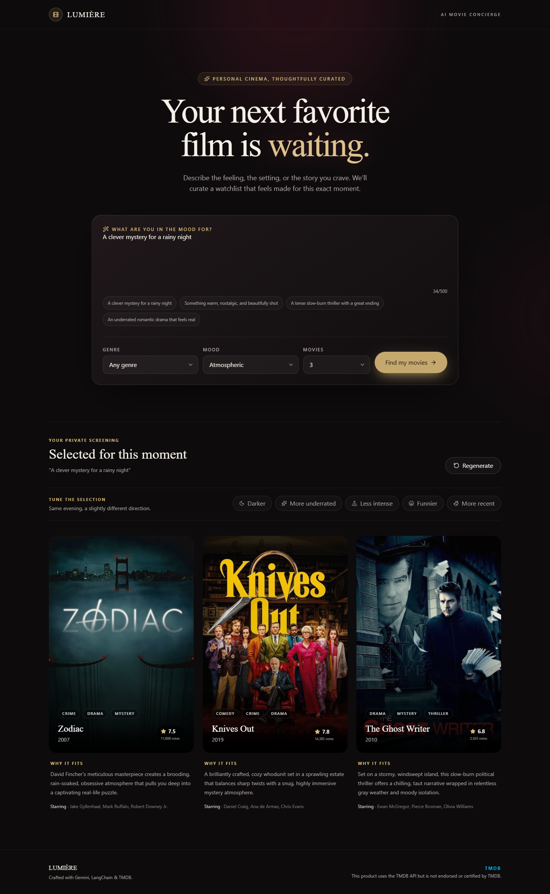
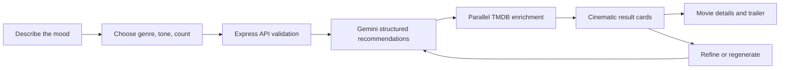
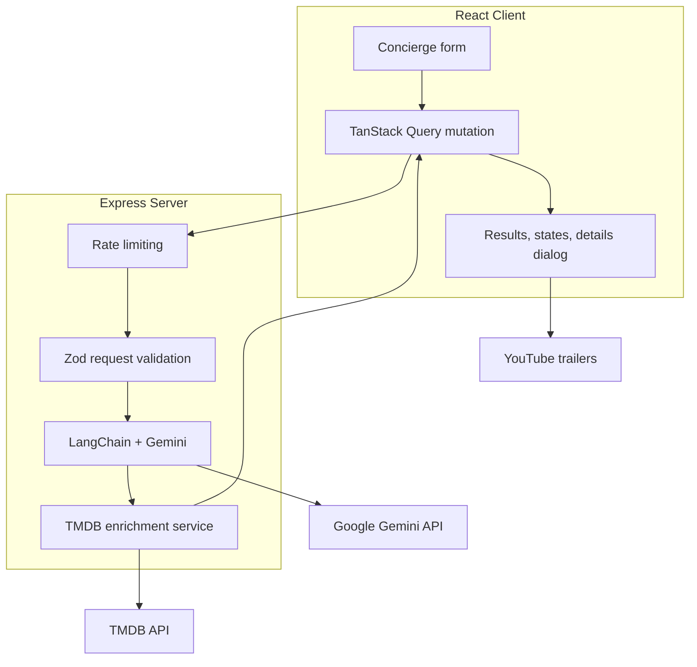

<div align="center">

# Lumière

### Your AI Movie Concierge

Describe the kind of evening you want. Lumière turns mood, genre, and intent into a thoughtful watchlist—then enriches every recommendation with real movie data from TMDB.

[](https://react.dev/)
[](https://www.typescriptlang.org/)
[](https://js.langchain.com/)
[](https://www.themoviedb.org/)
[](https://github.com/Eliya25/lumiere-ai-movie-concierge/actions/workflows/ci.yml)
[](LICENSE)
[](#testing)

[](https://lumiere-ai-movie-concierge.vercel.app/)
[](https://lumiere-ai-movie-concierge-api.vercel.app/health)

</div>

## Overview

Lumière is a full-stack portfolio project that explores what a movie recommender can feel like when it behaves less like a search form and more like a personal concierge.

Users describe a viewing mood in natural language, optionally choose a genre and tone, and receive a curated set of real films. Gemini handles the semantic recommendation work, while TMDB supplies canonical metadata, artwork, ratings, vote counts, overviews, and trailers.

The experience is presented through a responsive cinematic interface with deliberate motion, accessible interactions, resilient failure states, and a refinement loop that lets users reshape a watchlist without starting over.

## Live Product

[Open the live application](https://lumiere-ai-movie-concierge.vercel.app/) · [Check API health](https://lumiere-ai-movie-concierge-api.vercel.app/health)

[](https://lumiere-ai-movie-concierge.vercel.app/lumiere-demo.webm)

**[▶ Watch the 24-second product demo](https://lumiere-ai-movie-concierge.vercel.app/lumiere-demo.webm)** — from natural-language mood to enriched recommendations and movie details.

## Highlights

- Natural-language recommendations powered by Gemini through LangChain
- Structured, schema-validated AI output with Zod
- Real posters, backdrops, overviews, ratings, vote counts, and trailers from TMDB
- Contextual refinements: darker, more underrated, less intense, funnier, or more recent
- Regeneration that excludes titles already shown
- Responsive movie detail dialog with keyboard and focus management
- Loading skeletons, progressive poster loading, empty states, and retry flows
- Per-movie TMDB fault isolation with `Promise.allSettled`
- Strict request validation and safe server-only secrets
- Automated API and enrichment tests with Vitest and Supertest
- Per-IP rate limiting and configurable TTL caching for AI and TMDB requests
- Privacy-friendly traffic analytics and real-user Core Web Vitals through Vercel
- Reduced-motion support and keyboard-accessible interactions

## Product Flow



## Architecture



The frontend never receives or accesses provider credentials. All Gemini and TMDB communication happens on the Express server.

## Tech Stack

| Area | Technology |
| --- | --- |
| Frontend | React 19, Vite, TypeScript |
| Styling | Tailwind CSS 4, shadcn-style components |
| UI & motion | Radix UI, Motion, Lucide |
| Forms | React Hook Form, Zod |
| Server state | TanStack Query |
| Backend | Express 5, TypeScript, Node.js |
| API protection | express-rate-limit, bounded in-memory TTL caches |
| AI orchestration | LangChain, Google Gemini |
| Movie data | TMDB API v3 |
| Testing | Vitest, Supertest, Playwright |
| Observability | Vercel Web Analytics, Speed Insights, structured API logs |

## Repository Structure

```text
lumiere-ai-movie-concierge/
├── backend/
│   ├── src/
│   │   ├── controllers/       # HTTP request handling
│   │   ├── routes/            # Express routes
│   │   ├── schemas/           # Request and AI output schemas
│   │   ├── service/           # Gemini and TMDB integrations
│   │   ├── app.ts             # Testable Express application
│   │   └── index.ts           # Server entry point
│   ├── tests/                 # API and TMDB service tests
│   └── .env.example
├── frontend/
│   ├── src/
│   │   ├── api/               # Typed API client
│   │   ├── components/        # Product and UI components
│   │   ├── data/              # Shared response types
│   │   ├── lib/               # Utilities
│   │   └── App.tsx
│   ├── e2e/                   # Mocked Playwright product flow
│   ├── playwright.config.ts
│   └── .env.example
└── README.md
```

## Getting Started

### Prerequisites

- Node.js 20 or newer
- npm
- A Google API key with access to Gemini
- A TMDB API Read Access Token

### 1. Clone the repository

```bash
git clone https://github.com/Eliya25/lumiere-ai-movie-concierge.git
cd lumiere-ai-movie-concierge
```

### 2. Configure the backend

```bash
cd backend
npm install
```

Copy `backend/.env.example` to `backend/.env`, then provide your credentials:

```env
GOOGLE_API_KEY=your_google_api_key
TMDB_API_READ_TOKEN=your_tmdb_api_read_access_token
PORT=8000
CORS_ALLOWED_ORIGINS=http://localhost:5173,https://lumiere-ai-movie-concierge.vercel.app
AI_REQUEST_TIMEOUT_MS=45000
TMDB_REQUEST_TIMEOUT_MS=6000
RATE_LIMIT_WINDOW_MS=900000
RATE_LIMIT_MAX=20
RECOMMENDATION_CACHE_TTL_MS=600000
TMDB_CACHE_TTL_MS=86400000
CACHE_MAX_ENTRIES=500
```

Start the API:

```bash
npm run dev
```

The server is available at `http://localhost:8000`. Verify it with `GET /health`.

### 3. Configure the frontend

Open a second terminal:

```bash
cd frontend
npm install
```

The local API URL works by default. To override it, copy `frontend/.env.example` to `frontend/.env`:

```env
VITE_API_BASE_URL=http://localhost:8000
```

Start the client:

```bash
npm run dev
```

Open `http://localhost:5173`.

> Never commit `.env` files. They are ignored by Git; only the safe `.env.example` templates belong in the repository.

## API

### `POST /api/recommend`

Creates and enriches a movie watchlist.

#### Request

```json
{
  "userPrompt": "A clever mystery for a rainy night",
  "genre": "Mystery",
  "mode": "Atmospheric",
  "count": 3,
  "excludeTitles": ["Knives Out"],
  "refinement": "Make the selection darker and more psychologically intense."
}
```

`excludeTitles` and `refinement` are optional. `count` must be an integer from 1 to 6.

#### Response

```json
{
  "movies": [
    {
      "title": "Decision to Leave",
      "year": 2022,
      "genre": ["Mystery", "Romance"],
      "cast": ["Tang Wei", "Park Hae-il"],
      "reason": "A hypnotic mystery whose restrained tension suits the requested atmosphere.",
      "rating": 7.5,
      "tmdbId": 705996,
      "posterUrl": "https://image.tmdb.org/t/p/w500/...",
      "backdropUrl": "https://image.tmdb.org/t/p/w1280/...",
      "overview": "...",
      "tmdbRating": 7.3,
      "voteCount": 1200,
      "trailerKey": "...",
      "trailerUrl": "https://www.youtube.com/watch?v=..."
    }
  ]
}
```

Invalid input returns `400` with field-level validation details. Exceeding the per-IP quota returns `429` with standard `RateLimit` and `Retry-After` headers. Successful responses include `X-Cache: HIT` or `X-Cache: MISS`. Provider or recommendation failures return a safe `503` response with a request ID and without exposing credentials or internal error data.

## Resilience and Design Decisions

### Structured AI output

Gemini output is constrained by a Zod schema instead of parsed from free-form text. The server validates titles, years, genres, cast, reasons, and rating ranges before returning data.

### Graceful TMDB degradation

Movies are enriched concurrently with `Promise.allSettled`. One failed lookup never removes the other recommendations. Missing metadata is represented explicitly as `null`, allowing the UI to render a designed poster fallback.

Trailer lookup is isolated from the core movie lookup. If the Videos endpoint fails, the poster, backdrop, rating, and overview are preserved.

### Server-only credentials

`GOOGLE_API_KEY` and `TMDB_API_READ_TOKEN` remain in `backend/.env`. The browser only knows the public backend URL.

### Recommendation refinement

Refinement instructions are modeled separately from the original user prompt. Previously displayed titles are passed as a bounded exclusion list, keeping the original intent intact while reducing repeated recommendations.

### Rate limiting and bounded caching

The recommendation route is limited per IP before validation or provider work begins. Repeated identical recommendation requests are cached for 10 minutes, while successful TMDB enrichment is cached by normalized `title + year` for 24 hours. Both TTLs, the request quota, and the 500-entry memory bound are configurable through environment variables.

The current stores are intentionally process-local for the single-instance portfolio runtime. A horizontally scaled deployment should replace them with a shared Redis-compatible store such as Upstash.

## Testing

Run the backend suite:

```bash
cd backend
npm test
```

Current coverage includes:

- health endpoint behavior
- invalid, fractional, and out-of-range counts
- missing and unknown request fields
- bounded exclusion lists
- no-token TMDB fallback
- poster and backdrop URL generation
- official YouTube trailer selection
- Videos endpoint failure isolation
- per-movie network failure isolation
- TTL expiration and capacity eviction
- TMDB cache reuse
- standard rate-limit headers and enforced `429` responses

Frontend component coverage includes:

- form validation before API submission
- loading feedback and recoverable error handling
- recommendation rendering from a mocked API response

Run TypeScript and production checks:

```bash
cd backend
npx tsc --noEmit

cd ../frontend
npm test
npm run lint
npm run build
```

Run the mocked browser flow (no Gemini or TMDB credentials required):

```bash
cd frontend
npx playwright install chromium
npm run test:e2e
```

## Accessibility and UX

- Fully labeled form controls and inline validation
- Keyboard-operable cards and refinement actions
- Focus-trapped movie detail dialog with Escape dismissal
- Visible focus states
- Responsive one, two, and three-column result layouts
- `aria-live` and `aria-busy` feedback during recommendations
- `prefers-reduced-motion` support
- Progressive image loading and stable poster aspect ratios

## Project Status

- [x] Structured Gemini recommendations
- [x] TMDB artwork and metadata enrichment
- [x] Loading, empty, error, and poster fallback states
- [x] Movie detail dialog and external trailers
- [x] Contextual refinements and duplicate avoidance
- [x] Backend validation and automated tests
- [x] Production deployment
- [x] Rate limiting and bounded request caching
- [x] Mocked end-to-end recommendation flow
- [x] Project screenshot
- [x] 24-second product demo
- [x] Portfolio-ready production release

Lumière is feature-complete for its portfolio scope. Distributed Redis infrastructure and containerization are intentionally left out until a real scaling or deployment requirement justifies them.

## Attribution

This product uses the TMDB API but is not endorsed or certified by TMDB.

Movie metadata and imagery are provided by [The Movie Database](https://www.themoviedb.org/). Trailers open on YouTube and remain subject to their respective owners and platform terms.

## Author

Built by [Eliya25](https://github.com/Eliya25) as a full-stack AI portfolio project.
